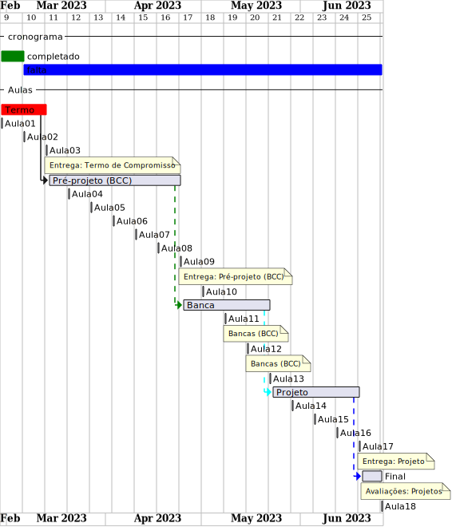
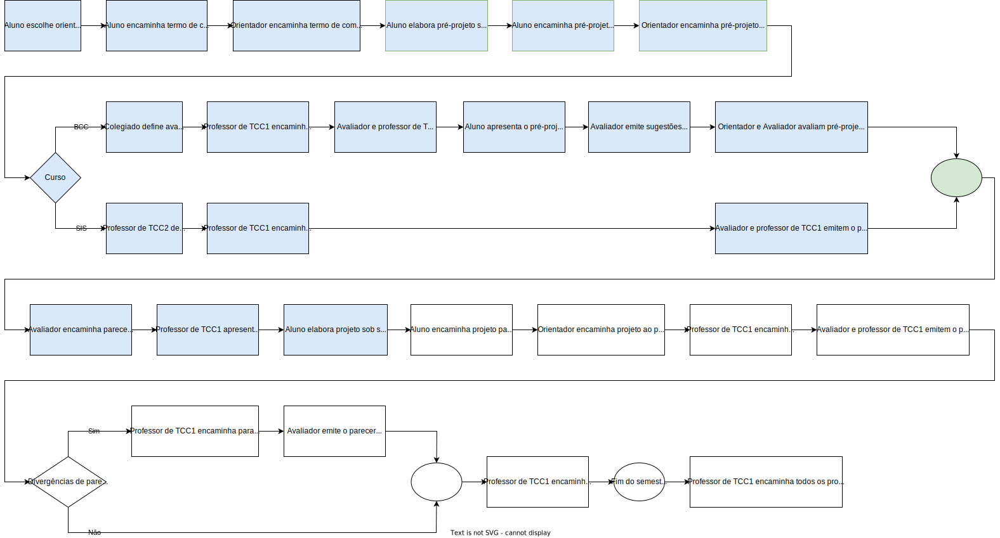
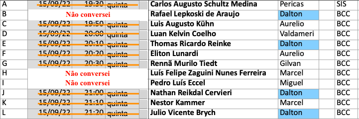
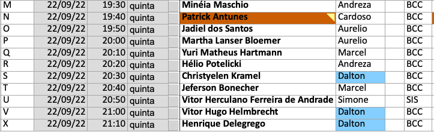

# Cronograma BCC

Local: Remoto (MS-Teams)  
Dia da semana: quinta-feira (18:30\~22:00)  

## Cronograma Resumido

<!-- ☞ bbf1208b-fad1-418c-a756-d8618c7a1419 -->
| Prazo              | Atividade                                       |  
| -------------------| ----------------------------------------------- |  
| 18/08              | Entrega do Termo de Compromisso                 |  
| 29/09 - 06/10      | Entrega do pré-projeto (curso de BCC)           |  
| 10 a 21/10         | Semana de bancas de qualificação (curso de BCC) |  
| 17/11              | Entrega do Projeto                              |  
|                    |                                                 |

## Cronograma Gantt

  

## Fluxograma

  

## Cronograma Completo

### \[Aula_01] 04-08-2022 quinta-feira

- [aula01Anotacoes](../Aulas/aula01Anotacoes.md "aula01Anotacoes")  
- Termo - Formulação  

### \[Aula_02] 11-08-2022 quinta-feira

<!-- \[AVISO] Termo atraso https://github.com/dalton-reis/disciplinaTCC1Privado/projects/1#card-67011391 -->  

- [aula02Anotacoes](../Aulas/aula02Anotacoes.md "aula02Anotacoes")  
- Termo - Formulação  

### \[Aula_03] 18-08-2022 quinta-feira

- **Entrega do Termo de Compromisso de TCC**  
- [aula03Anotacoes](../Aulas/aula03Anotacoes.md "aula03Anotacoes")  
- Pré-Projeto - Formulação  

### \[Aula_04] 25-08-2022 quinta-feira

<!-- \[AVISO] Orientadores https://github.com/dalton-reis/disciplinaTCC1Privado/projects/1#card-67524750 -->
- [aula04Anotacoes](../Aulas/aula04Anotacoes.md "aula04Anotacoes")  
- Pré-Projeto - Formulação  

### \[Aula_05] 01-09-2022 quinta-feira

- [aula05Anotacoes](../Aulas/aula05Anotacoes.md "aula05Anotacoes")  
- Pré-Projeto - Formulação  

<!-- \[AVISO] banca BCC https://github.com/dalton-reis/disciplinaTCC1Privado/projects/1#card-67445813 -->
### \[Aula_06] 08-09-2022 quinta-feira
<!-- FIXME: antecipar uma semana o atendimento individual do BCC para ter uma semana livre antes da entrega -->

- Pré-Projeto - Formulação  

### \[Aula_07] 15-09-2022 quinta-feira

<!-- \[AVISO] Atendimento BCC: https://github.com/dalton-reis/disciplinaTCC1Privado/projects/1#card-85660899 -->

- Pré-Projeto - Atendimento Individual  
  

### \[Aula_08] 22-09-2022 quinta-feira

- Pré-Projeto - Atendimento Individual
  

### \[Aula_09] 29-09-2022 quinta-feira

- **Entrega do Pré-Projeto (BCC)**
- Iteração FURB  

### \[Aula_10] 06-10-2022 quinta-feira

- [aula10AnotacoesBCC](../Aulas/aula10AnotacoesBCC.md "aula10AnotacoesBCC")  
- Revisão dos Pré-Projetos pelos professores de TCC1 e avaliadores.  

### \[Aula_11] 13-10-2022 quinta-feira

<!-- \[ ] Revisão dos Pré-Projetos: https://github.com/dalton-reis/disciplinaTCC1Privado/projects/1#card-86157761 -->
- Revisão dos Pré-Projetos pelos professores de TCC1 e avaliadores.  
- **Semana de bancas (BCC)**  
- **não tem aula**  

### \[Aula_12] 20-10-2022 quinta-feira

- Revisão dos Pré-Projetos pelos professores de TCC1 e avaliadores.  
- **Semana de bancas (BCC)**  
- [Escola Regional de Engenharia de Software - ERES](https://eres-sbc-br.github.io/eres2022/ "Escola Regional de Engenharia de Software - ERES")  
- **não tem aula**  

### \[Aula_13] 27-10-2022 quinta-feira

- estarei no evento: <https://sbgames.org/sbgames2022/>  
- **Não teremos aula**

### \[Aula_14] 03-11-2022 quinta-feira

- [aula13Anotacoes](../Aulas/aula13Anotacoes.md "aula13Anotacoes")  
- Análise do Pré-Projeto  

### \[Aula_15] 10-11-2022 quinta-feira

- Análise do Pré-Projeto - Atendimento Individual  

### \[Aula_16] 17-11-2022 quinta-feira

<!-- - **Entrega do Projeto**  -->
- Análise do Pré-Projeto - Atendimento Individual  

### \[Aula_17] 24-11-2022 quinta-feira

- Análise do Pré-Projeto - Atendimento Individual  
- Avaliação dos Projetos (banca)  

### \[Aula_18] 01-12-2022 quinta-feira

- **Entrega do Projeto**
- Avaliação dos Projetos (banca)  

### 13-12-2022

- Data final para devolução dos projetos pelos avaliadores  

-----------

Último dia para entregar os diários de classe 2022/2: 03/12/22 - 13/12/22  
