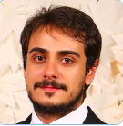

# Anotações das Reuniões Individuais  

  
Orientando: Rafael Lepkoski de Araujo  
Orientador: Dalton  
Título: Biblioteca para Análise de Movimentos Corporais  

## Atendimento Termo  

[Termo](Termo.pdf "Termo")  

### 2022-08-11

Dispensei do atendimento individual porque vai continuar com o tema de TCC1 do semestre anterior.  
Orientador: Dalton.  

## Atendimento Pré-Projeto  

Percentual estimado:  
Comentários:  **TCC1 - atendimento individual: não respondeu**  

## Atendimento Projeto  

Percentual estimado:  
Comentários:  
