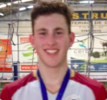

# Anotações das Reuniões Individuais  

  
Orientando: Felipe de Jesus Vieira  
Orientador: Cardoso  
Título: Sport Finder: Uma Aplicação Web para Eventos Esportivos  

## Atendimento Termo  

[Termo](Termo.pdf "Termo")  

### 2022-08-09

Orientador: Cardoso.  
Título: Fomentar e Fortalecer a Prática Desportiva.  
Programação Web na disciplina.  

## Atendimento Pré-Projeto  

Percentual estimado:  
Comentários:  

## 2022-09-16

Olá professor Dalton!  
Sim, eu acabei ficando preso em algumas reuniões no trabalho pois estamos em final de Sprint e outras atividades pelas quais sou responsável lá também, peço desculpas.  
Conversei com o pessoal que também faz a disciplina, comentaram que você passou uma espécie de avaliação para ver "em que pé está" o desenvolvimento do pré-projeto.  
No meu caso estou bem no começo ainda, identifiquei os trabalhos correlatos e validei com o meu orientador, prof. Marcos, e já comecei a desenvolver a primeira parte, introdução e objetivos.  
[14:02] Dalton Solano dos Reis  
Ok, bom, pelo o que me passasse estais com uns 15% do Pré-Projeto. E olhando o cronograma estais bem atrasado.  
Então recomendo fortemente acelerar o desenvolvimento da descrição do texto.  

## Atendimento Projeto  

Percentual estimado:  
Comentários:  
