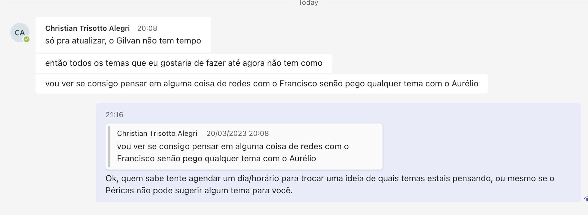

# Anotações das Reuniões

Orientando: Christian Trisotto Alegri  
Orientador: Aurelio  
Título: Sistemas Multiagentes Aplicado a Futebol de Robôs  

## Atendimento Termo

Orientador:  
Assunto:  
Comentários:  
  não atendeu o chamado no Teams na hora marcada  
  enviei msg no Teams pedindo estas informações  

### 2023-02-28 - 20:39

A ideia mais provável que vou usar é um algoritmo de inteligência artificial treinado pra prever o preço de ações. Entrei em contato com a Andreza mas sem resposta ainda.  

### 2023-03-06 - 20:25

Disse que a Andreza ja ia ligar para falar sobre o termo.  

### 2023-03-07 - 12:16

Já existe um TCC com este assunto. Aconselhei mesmo assim falar com Aurélio/Andreza para ver nào poderia continuar com o assunto e mudar um pouco o foco.  

## 2023-03-13 - 20:45

Encriptação Zk-Snark  
Gilvan  
Passei o e-mail, passei horários dele na FURB das aulas.  

## 2023-03-20 - 21:43

  

## Atendimento Pré-Projeto

Percentual estimado:  
Comentários:  

## Atendimento Projeto

Percentual estimado:  
Comentários:  
