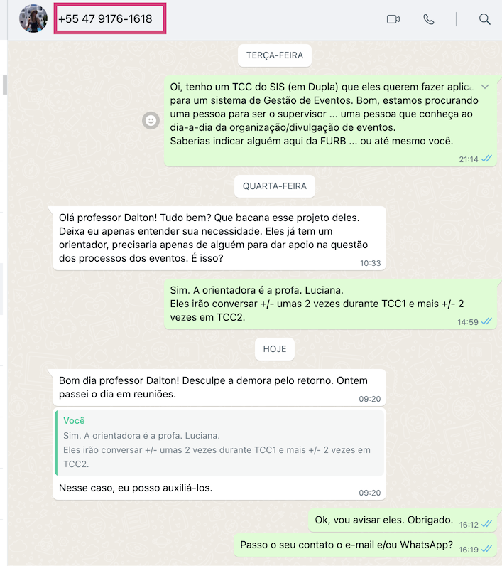

# Anotações das Reuniões

Orientando: Gabriel Eduardo Jansen / Thiago Nunes Ferrari  
Orientador: Simone  
Título: Quickevent: Gerenciamento e Busca de Eventos de Forma Rápida  

## Atendimento Termo

Orientador: Simone  
Assunto:  
Comentários:  
Aplicativo para Divulgação de Eventos.  

Aplicado: pessoa indicada é um aluno que cuida da Atlética do curso e Medicina.  

Pedi para melhorar:

- indiquei a Karoline para falar com Janaína da Polly Formaturas.  
- aluno disse que tinha um conhecido que conhecia alguém da FURB.  
- envia Whats para Ana Paula Zonta
Oi, tenho um TCC do SIS (em Dupla) que eles querem fazer aplicado para um sistema de Gestão de Eventos. Bom, estamos procurando uma pessoa para ser o supervisor ... uma pessoa que conheça ao dia-a-dia da organização/divulgação de eventos.
Saberias indicar alguém aqui da FURB ... ou até mesmo você.  

  

## Atendimento Pré-Projeto

Percentual estimado:  
Comentários:  

## Atendimento Projeto

Percentual estimado:  
Comentários:  
