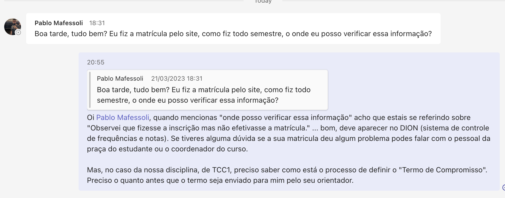

# Anotações das Reuniões

Orientando: Pablo Mafessoli  
Orientador: Andreza  
Título: Aplicativo para Auxílio em Resgate de Animais Silvestres

## Atendimento Termo

## 2023-03-14 - 21:17

Se matriculou tarde na disciplina. Enviei uma mensagem no MS-Teams explicando o que deveria fazer e chamando a atenção que está atrasado.  

## 2023-03-21 - 21:18

  

Orientador:  
Assunto:  
Comentários:  

## Atendimento Pré-Projeto

### 2023-04-17 - 20:25

Percentual estimado: 15%  
Comentários: descreveu um pouco da Introdução e dos trabalhos correlatos. Está muito atrasado e aconselhei **fortemente** recuperar o cronograma.
Comentou ter algumas dúvidas sobre as "partes" do pré-projeto. Como não assistiu quase um mês de aula aconselhei olhar o conteúdo das aulas no material da disciplina e assistir as video-aulas. E, se tiver dúvidas me perguntar.  
**ATENÇÃO**: não está usando o Word desktop e tem vários problemas com formatação e normas da ABNT.  

## Atendimento Projeto

Percentual estimado:  
Comentários:  
