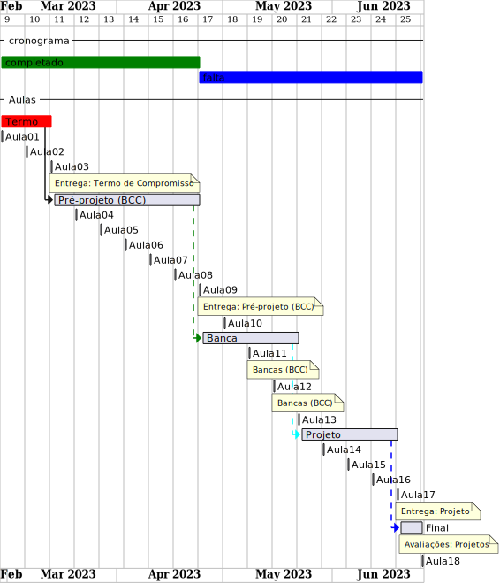
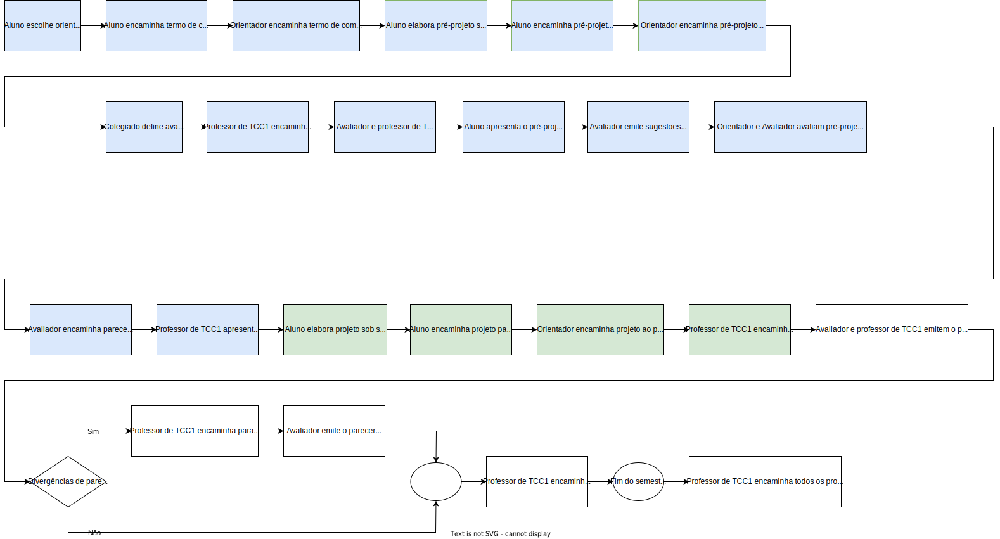

# Cronograma:  2024-2 BCC  
  
Local:  Remoto (MS-Teams)  
Dia da semana:  Segundas (20:20\~22:00)  
  
<!-- [ ] Aviso: Inicio das aulas <> -->  
  
## Eventos  
  
<!-- [Semana Acadêmica](https://github.com/dalton-reis/dalton-reis/blob/main/_._/semanaAcademica.md "Semana Acadêmica")  -->  
[SEMINCO](https://github.com/dalton-reis/dalton-reis/blob/main/_._/seminco.md "SEMINCO")  
  
## Observações de Entrega  
  
- todas as entregas ([Termo de Compromisso](../Aulas/aula01Anotacoes.md#termo-de-compromisso "Termo de Compromisso"), [Pré-Projeto](../Aulas/aula02Anotacoes.md#modelos-projetos "Pré-Projeto") e [Projeto](../Aulas/aula02Anotacoes.md#modelos-projetos "Projeto")) devem ser encaminhadas por e-mail ao orientador que deverá repassar para o professor de TCC1 com um “De acordo”. Não encaminhe nada direto para o professor de TCC1 pois não será considerado válido;  
- certifique-se com o professor de TCC1 se o orientador fez o encaminhamento para o professor de TCC1;  
- encaminhamentos que não forem feitos (para o Pré-Projeto e Projeto) em até no máximo 3 dias após o prazo estabelecido implica na reprovação do estudante;  
- todos os arquivos encaminhados devem ser em formato "docx".  25-11-2024  |  
  
**ATENÇÃO**: sempre antes de encaminhar a entrega gere do arquivo "docx" um arquivo em "pdf" para verificar senão ocorreu nenhum erro.  
  
## Cronograma Resumido  
  
| Atividade | Prazo |  
|--- | ---- |  
| Entrega do Termo de Compromisso | 12-08-2024 |  
| Entrega do pré-projeto (curso de BCC) | 30-09-2024 |  
| Entrega do Projeto | 25-11-2024 |  
|  |  
  
## Cronograma Gantt  
  
  
  
## Fluxograma  
  
  
  
## Cronograma Completo  
  
### Aula_01 05-08-2024  ( segunda-feira )  
  
<!-- \[AVISO] Termo atraso https://github.com/dalton-reis/disciplinaTCC1Privado/projects/1#card-67011391 -->  
- [aula01Anotacoes](../Aulas/aula01Anotacoes.md "aula01Anotacoes")  
- [aula01Slides](../Aulas/aula01Slides.pdf "aula01Slides")  
- [aula02Anotacoes](../Aulas/aula02Anotacoes.md "aula02Anotacoes")  
- [aula02Slides](../Aulas/aula02Slides.pdf "aula02Slides")  
- Termo - Formulação  
  
### Aula_02 12-08-2024  ( segunda-feira )  
  
- **Entrega do Termo de Compromisso de TCC**  
- [aula03Anotacoes](../Aulas/aula03Anotacoes.md "aula03Anotacoes")  
- [aula03Slides](../Aulas/aula03Slides.pdf "aula03Slides")  
- Pré-Projeto - Formulação  
  
### Aula_03 19-08-2024  ( segunda-feira )  
  
<!-- \[AVISO] Orientadores https://github.com/dalton-reis/disciplinaTCC1Privado/projects/1#card-67524750 -->  
- [aula04Anotacoes](../Aulas/aula04Anotacoes.md "aula04Anotacoes")  
- [aula04Slides](../Aulas/aula04Slides.pdf "aula04Slides")  
- Pré-Projeto - Formulação  
  
### Aula_04 26-08-2024  ( segunda-feira )  
  
<!-- \[AVISO] banca BCC https://github.com/dalton-reis/disciplinaTCC1Privado/projects/1#card-67445813 -->  
- [aula05Anotacoes](../Aulas/aula05Anotacoes.md "aula05Anotacoes")  
- Pré-Projeto - Formulação  
  
### Aula_05 02-09-2024  ( segunda-feira )  
  
- **não tem aula**  - Feriado: Município de Blumenau  
  
### Aula_06 09-09-2024  ( segunda-feira )  
  
<!-- \[AVISO] Atendimento BCC: https://github.com/dalton-reis/disciplinaTCC1Privado/projects/1#card-85660899 -->  
- Pré-Projeto - Atendimento Individual  
  
  
### Aula_07 16-09-2024  ( segunda-feira )  
  
- Pré-Projeto - Atendimento Individual  
  
  
### Aula_08 23-09-2024  ( segunda-feira )  
  
- Pré-Projeto - Atendimento Individual  
  
  
### Aula_09 30-09-2024  ( segunda-feira )  
  
- **Entrega do Pré-Projeto (BCC)**  
- [aula09AnotacoesBCC](../Aulas/aula09AnotacoesBCC.md "aula09AnotacoesBCC")  
- **não tem aula**  - Congresso SBGames / SVR / Sibgraphi (Manaus)  
  
### Aula_10 07-10-2024  ( segunda-feira )  
  
- **não tem aula**  - SEMINCO  
  
### Aula_11 14-10-2024  ( segunda-feira )  
  
<!-- \[ ] Revisão dos Pré-Projetos: https://github.com/dalton-reis/disciplinaTCC1Privado/projects/1#card-86157761 -->  
- Revisão dos Pré-Projetos pelos professores de TCC1 e avaliadores.  
- **não tem aula**  
  
### Aula_12 21-10-2024  ( segunda-feira )  
  
- Revisão dos Pré-Projetos pelos professores de TCC1 e avaliadores.  
- **não tem aula**  
  
### Aula_13 28-10-2024  ( segunda-feira )  
  
- **não tem aula**  - Feriado: Dia do Servidor Público  
  
### Aula_14 04-11-2024  ( segunda-feira )  
  
- [aula13Anotacoes](../Aulas/aula13Anotacoes.md "aula13Anotacoes")  
- Análise do Pré-Projeto - Atendimento Individual  
  
### Aula_15 11-11-2024  ( segunda-feira )  
  
- Análise do Pré-Projeto - Atendimento Individual  
  
### Aula_16 18-11-2024  ( segunda-feira )  
  
- Análise do Pré-Projeto - Atendimento Individual  
  
### Aula_17 25-11-2024  ( segunda-feira )  
  
- **Entrega do Projeto**  
- Avaliação dos Projetos (banca)  
  
### Aula_18 02-12-2024  ( segunda-feira )  
  
- Avaliação dos Projetos (banca)  
  
<!-- [ ] Aviso: DION: fechar notas <> -->  
- Data final para devolução dos projetos pelos avaliadores:  04/07/23  
Último dia para entregar os diários de classe 2024/2: 30/11/24 - 10/12/24  
