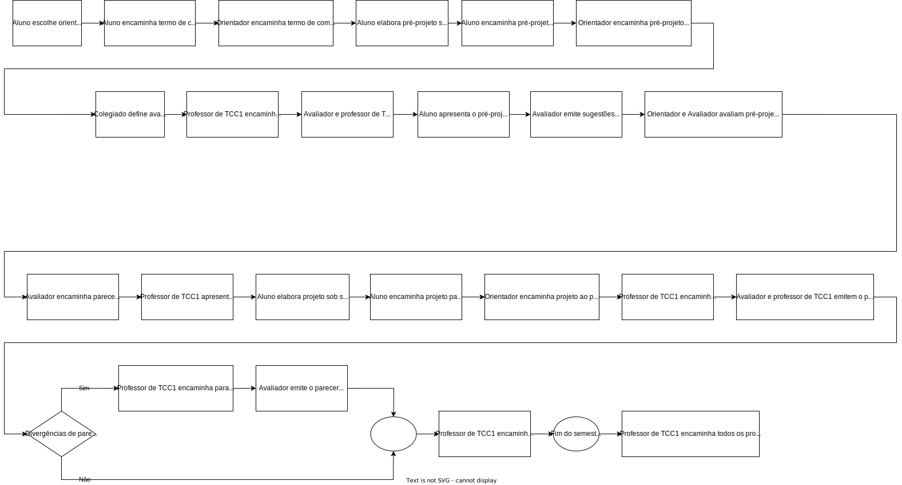

# Cronograma: BCC  2023-1 BCC  

Local:  Remoto (MS-Teams)  
Dia da semana:  Segundas (18:30\~22:00)  
  
<!-- [ ] Aviso: Inicio das aulas <> -->  

## Eventos  

[Semana Acadêmica](https://github.com/dalton-reis/dalton-reis/blob/main/_._/semanaAcademica.md "Semana Acadêmica")  

<!-- [SEMINCO: BCC](<> "SEMINCO: BCC")  -->

## Observações de Entrega  

- todas as entregas ([Termo de Compromisso](../Aulas/aula01Anotacoes.md#termo-de-compromisso "Termo de Compromisso"), [Pré-Projeto](../Aulas/aula02Anotacoes.md#modelos-projetos "Pré-Projeto") e [Projeto](../Aulas/aula02Anotacoes.md#modelos-projetos "Projeto")) devem ser encaminhadas por e-mail ao orientador que deverá repassar para o professor de TCC1 com um “De acordo”. Não encaminhe nada direto para o professor de TCC1 pois não será considerado válido;  
- certifique-se com o professor de TCC1 se o orientador fez o encaminhamento para o professor de TCC1;  
- encaminhamentos que não forem feitos (para o Pré-Projeto e Projeto) em até no máximo 3 dias após o prazo estabelecido implica na reprovação do estudante;  
- todos os arquivos encaminhados devem ser em formato "docx".  

**ATENÇÃO**: sempre antes de encaminhar a entrega gere do arquivo "docx" um arquivo em "pdf" para verificar senão ocorreu nenhum erro.  

## Cronograma Resumido  
  
| Atividade | Prazo |  
|--- | ---- |  
| Entrega do Termo de Compromisso |  13-03-2023  |  
| Entrega do pré-projeto (curso de BCC) |  24-04-2023  |  
| Semana de bancas de qualificação (curso de BCC) |  01-05-2023  |  
| Entrega do Projeto |  19-06-2023  |  
|  |  |  
  
## Cronograma Gantt  
  
  
  
## Fluxograma  
  
  
  
## Cronograma Completo  
  
### Aula_01 27-02-2023  ( segunda-feira )  
  
- [aula01Anotacoes](../Aulas/aula01Anotacoes.md "aula01Anotacoes")  
- Termo - Formulação  
- Termo - Atendimento Individual  

  - [x] Jeferson Bonecher  
  - [x] Thomas Michels Rodrigues  
  - [x] Guilherme Fibrantz  
  - [x] Eduarda Engels  
  - [x] Everton Luiz Piccoli  
  - [x] Gustavo Felipe Soares  
  - [x] Nathan Reikdal Cervieri  
  - [x] Giancarlo Cavalli  
  - [x] Igor Christofer Eisenhut  
  - [x] Christian Trisotto Alegri  
  - [x] Rossana Ariadna Schumann Dullius  
  - [x] Camila Carolina Bowens  
  - [x] Bruno Ricardo Junkes  
  
### Aula_02 06-03-2023  ( segunda-feira )  
  
<!-- \[AVISO] Termo atraso https://github.com/dalton-reis/disciplinaTCC1Privado/projects/1#card-67011391 -->  
- [aula02Anotacoes](../Aulas/aula02Anotacoes.md "aula02Anotacoes")  
- [aula02Slides](../Aulas/aula02Slides.pdf "aula02Slides")  
- Termo - Formulação  
  
### Aula_03 13-03-2023  ( segunda-feira )  
  
- **Entrega do Termo de Compromisso de TCC**  
- [aula03Anotacoes](../Aulas/aula03Anotacoes.md "aula03Anotacoes")  
- [aula03Slides](../Aulas/aula03Slides.pdf "aula03Slides")
- Pré-Projeto - Formulação  
  
### Aula_04 20-03-2023  ( segunda-feira )  
  
<!-- \[AVISO] Orientadores https://github.com/dalton-reis/disciplinaTCC1Privado/projects/1#card-67524750 -->  
- [aula04Anotacoes](../Aulas/aula04Anotacoes.md "aula04Anotacoes")  
- [aula04Slides](../Aulas/aula04Slides.pdf "aula04Slides")  
- Pré-Projeto - Formulação  
  
### Aula_05 27-03-2023  ( segunda-feira )  
  
<!-- \[AVISO] banca BCC https://github.com/dalton-reis/disciplinaTCC1Privado/projects/1#card-67445813 -->  
- [aula05Anotacoes](../Aulas/aula05Anotacoes.md "aula05Anotacoes")  
- Pré-Projeto - Formulação  
  
### Aula_06 03-04-2023  ( segunda-feira )  
  
- Pré-Projeto - Formulação  
  
### Aula_07 10-04-2023  ( segunda-feira )  
  
<!-- \[AVISO] Atendimento BCC: https://github.com/dalton-reis/disciplinaTCC1Privado/projects/1#card-85660899 -->  
- Pré-Projeto - Atendimento Individual  

  - [ ]  

### Aula_08 17-04-2023  ( segunda-feira )  
  
- Pré-Projeto - Atendimento Individual  

  - [ ]  
  
### Aula_09 24-04-2023  ( segunda-feira )  
  
- **Entrega do Pré-Projeto (BCC)**  
- [aula09AnotacoesBCC](../Aulas/aula09AnotacoesBCC.md "aula09AnotacoesBCC")  
  
### Aula_10 01-05-2023  ( segunda-feira )  
  
- Feriado: Dia do Trabalhador  
  
### Aula_11 08-05-2023  ( segunda-feira )  
  
<!-- \[ ] Revisão dos Pré-Projetos: https://github.com/dalton-reis/disciplinaTCC1Privado/projects/1#card-86157761 -->  
- Revisão dos Pré-Projetos pelos professores de TCC1 e avaliadores.  
- **Semana de bancas (BCC)**  
- **não tem aula**  
  
### Aula_12 15-05-2023  ( segunda-feira )  
  
- Revisão dos Pré-Projetos pelos professores de TCC1 e avaliadores.  
- **Semana de bancas (BCC)**  
- **não tem aula**  
  
### Aula_13 22-05-2023  ( segunda-feira )  
  
- [aula13Anotacoes](../Aulas/aula13Anotacoes.md "aula13Anotacoes")  
- Análise do Pré-Projeto  
  
### Aula_14 29-05-2023  ( segunda-feira )  
  
- Análise do Pré-Projeto - Atendimento Individual  
  
### Aula_15 05-06-2023  ( segunda-feira )  
  
- Análise do Pré-Projeto - Atendimento Individual  
  
### Aula_16 12-06-2023  ( segunda-feira )  
  
- Análise do Pré-Projeto - Atendimento Individual  
  
### Aula_17 19-06-2023  ( segunda-feira )  
  
- **Entrega do Projeto**  
- Avaliação dos Projetos (banca)  
  
### Aula_18 26-06-2023  ( segunda-feira )  
  
- Avaliação dos Projetos (banca)  
  
<!-- [ ] Aviso: DION: fechar notas <> -->  
- Data final para devolução dos projetos pelos avaliadores:  04/07/23  
Último dia para entregar os diários de classe 2023/1: 24/06/23 - 04/07/23  
