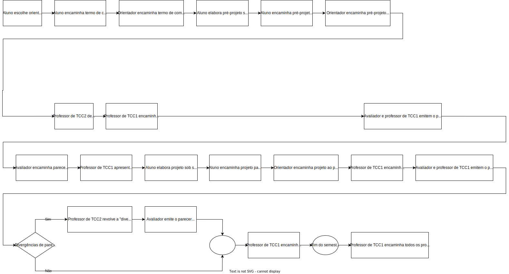

# Cronograma:   2023-1 SIS  
  
Local:   Remoto (MS-Teams)  
Dia da semana:   Terças (18:30\~22:00)  
  
<!-- [ ] Aviso: Inicio das aulas <> -->  
  
## Cronograma Resumido  
  
| Atividade | Prazo |  
|--- | ---- |  
| Entrega do Termo de Compromisso |   14-03-2023  |  
| Entrega do pré-projeto (curso de SIS) |   25-04-2023  |  
| Entrega do Projeto |   20-06-2023  |  
|   |  |  
  
## Cronograma Gantt  
  
  
  
## Fluxograma  
  
  
  
## Cronograma Completo  
  
### Aula_01 28-02-2023  ( terça-feira )  
  
- [aula01Anotacoes](../Aulas/aula01Anotacoes.md "aula01Anotacoes")  
- Termo - Formulação  
  

### Aula_02 07-03-2023  ( terça-feira )  
  
<!-- \[AVISO] Termo atraso https://github.com/dalton-reis/disciplinaTCC1Privado/projects/1#card-67011391 -->  
- [aula02Anotacoes](../Aulas/aula02Anotacoes.md "aula02Anotacoes")  
- [aula02Slides](../Aulas/aula02Slides.pdf "aula02Slides")  
- Termo - Formulação  
  
### Aula_03 14-03-2023  ( terça-feira )  
  
- **Entrega do Termo de Compromisso de TCC**  
- [aula03Anotacoes](../Aulas/aula03Anotacoes.md "aula03Anotacoes")  
- [aula03Slides](../Aulas/aula03Slides.pdf “aula03Slides")  
- Pré-Projeto - Formulação  
  
### Aula_04 21-03-2023  ( terça-feira )  
  
<!-- \[AVISO] Orientadores https://github.com/dalton-reis/disciplinaTCC1Privado/projects/1#card-67524750 -->  
- [aula04Anotacoes](../Aulas/aula04Anotacoes.md "aula04Anotacoes")  
- [aula04Slides](../Aulas/aula04Slides.pdf “aula04Slides")  
- Pré-Projeto - Formulação  
  
### Aula_05 28-03-2023  ( terça-feira )  
  
<!-- \[AVISO] banca BCC -->  
- [aula05Anotacoes](../Aulas/aula05Anotacoes.md “aula05Anotacoes")  
- Pré-Projeto - Formulação  
  
### Aula_06 04-04-2023  ( terça-feira )  
  
- Pré-Projeto - Formulação  
  
### Aula_07 11-04-2023  ( terça-feira )  
  
<!-- \[AVISO] Atendimento SIS: https://github.com/dalton-reis/disciplinaTCC1Privado/projects/1#card-85660899 -->  
- Pré-Projeto - Atendimento Individual  
  
  
### Aula_08 18-04-2023  ( terça-feira )  
  
- Pré-Projeto - Atendimento Individual  
  
  
### Aula_09 25-04-2023  ( terça-feira )  
  
- **Entrega do Pré-Projeto (SIS)**  
- [aula09AnotacoesSIS](../Aulas/aula09AnotacoesSIS.md "aula09AnotacoesSIS")  
  
### Aula_10 02-05-2023  ( terça-feira )  
  
- Semana Acadêmica (não tem aula)  
  
### Aula_11 09-05-2023  ( terça-feira )  
  
<!-- \[ ] Revisão dos Pré-Projetos: https://github.com/dalton-reis/disciplinaTCC1Privado/projects/1#card-86157761 -->  
- Revisão dos Pré-Projetos pelos professores de TCC1 e avaliadores.  
  
- **não tem aula**  
  
### Aula_12 16-05-2023  ( terça-feira )  
  
- Revisão dos Pré-Projetos pelos professores de TCC1 e avaliadores.  
  
- **não tem aula**  
  
### Aula_13 23-05-2023  ( terça-feira )  
  
- [aula13Anotacoes](../Aulas/aula13Anotacoes.md “aula13Anotacoes")  
- Análise do Pré-Projeto  
  
### Aula_14 30-05-2023  ( terça-feira )  
  
- Análise do Pré-Projeto - Atendimento Individual  
  
### Aula_15 06-06-2023  ( terça-feira )  
  
- Análise do Pré-Projeto - Atendimento Individual  
  
### Aula_16 13-06-2023  ( terça-feira )  
  
- Análise do Pré-Projeto - Atendimento Individual  
  
### Aula_17 20-06-2023  ( terça-feira )  
  
- **Entrega do Projeto**  
- Avaliação dos Projetos (banca)  
  
### Aula_18 27-06-2023  ( terça-feira )  
  
- Avaliação dos Projetos (banca)  
  
<!-- [ ] Aviso: DION: fechar notas <> -->  
- Data final para devolução dos projetos pelos avaliadores:  04/07/23  
Último dia para entregar os diários de classe 2023/1: 24/06/23 - 04/07/23  
