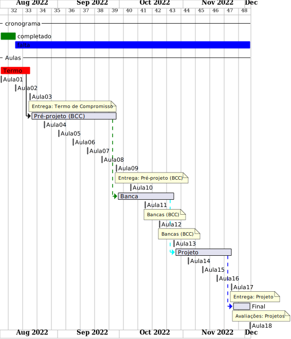

# Cronograma BCC

Local: Remoto (MS-Teams)  
Dia da semana: quinta-feira (18:30\~22:00)  

## Cronograma Resumido

<!-- ☞ bbf1208b-fad1-418c-a756-d8618c7a1419 -->
| Prazo      | Atividade                                       |  
| ---------- | ----------------------------------------------- |  
| 18/08      | Entrega do Termo de Compromisso                 |  
| 29/09      | Entrega do pré-projeto (curso de BCC)           |  
| 10 a 21/10 | Semana de bancas de qualificação (curso de BCC) |  
| 17/11      | Entrega do Projeto                              |  

## Cronograma Gantt

  

## Fluxograma

  

## Observações

- Todas as entregas (Termo de Compromisso, Pré-Projeto e Projeto) devem ser encaminhadas por e-mail ao orientador que deverá repassar para o professor de TCC1 com um “De acordo”. Não encaminhe nada direto para o professor de TCC1 pois não será considerado válido.  
- Certifique-se que o orientador fez o encaminhamento para o professor de TCC1.  
- Encaminhamentos que não forem feitos (para o Pré-Projeto e Projeto) em até no máximo 3 dias após o prazo estabelecido implica na reprovação do estudante.  
- Todos os arquivos encaminhados devem ser em formato "docx".  

**ATENÇÃO**: sempre antes de encaminhar a entrega gere do arquivo "docx" um arquivo em "pdf" para verificar senão ocorreu nenhum erro.  

## Cronograma Completo

### [Aula_01] 04-08-2022 quinta-feira

- Apresentação do Professor  
- Apresentação da Disciplina  
- Tipos de TCC: visão geral  
- Cronograma  
- Regulamento do TCC  
- Encaminhamentos para o Termo de Compromisso  
- Diagnóstico sobre orientações  

[anotacoesAula01](aula01Anotacoes.md "anotacoesAula01")  

### [Aula_02] 11-08-2022 quinta-feira

<!-- [ ] Aviso: Termo atraso <https://github.com/dalton-reis/disciplinaTCC1Privado/projects/1#card-67011391> -->  
- Como estabelecer um problema de pesquisa  
- Modelos dos Projetos  
- Partes constituintes do Projeto  
- Exemplos de Projetos  

[anotacoesAula02](aula02Anotacoes.md "anotacoesAula02")  

### [Aula_03] 18-08-2022 quinta-feira

- **Entrega do Termo de Compromisso de TCC**  
- Erros de redação  
- Normas ABNT: citações e referências  
- Dicas do uso do Editor MS-Word  
- Pré-Projeto - Formulação  

[anotacoesAula03](aula03Anotacoes.md "anotacoesAula03")  

### [Aula_04] 25-08-2022 quinta-feira

<!-- [ ] Aviso: Orientadores <https://github.com/dalton-reis/disciplinaTCC1Privado/projects/1#card-67524750> -->
<!-- [ ] Aviso: banca BCC <https://github.com/dalton-reis/disciplinaTCC1Privado/projects/1#card-67445813> -->
- Pré-Projeto - Formulação  

### [Aula_05] 01-09-2022 quinta-feira

- Pré-Projeto - Formulação  

### [Aula_06] 08-09-2022 quinta-feira

- Pré-Projeto - Formulação  

### [Aula_07] 15-09-2022 quinta-feira

<!-- [ ] aviso Atendimento BCC: <https://github.com/dalton-reis/disciplinaTCC1Privado/projects/1#card-67514804> -->  
- Pré-Projeto - Atendimento Individual  
<!-- **[Atendimento BCC](Material/AtendimentoBCC.png "Atendimento BCC")** -->  

### [Aula_08] 22-09-2022 quinta-feira

- Pré-Projeto - Atendimento Individual

### [Aula_09] 29-09-2022 quinta-feira

- **Entrega do Pré-Projeto (BCC)**
- Iteração FURB  

### [Aula_10] 06-10-2022 quinta-feira

- Preparação das apresentações (BCC)  
- Revisão dos Pré-Projeto pelos professores de TCC1 e avaliadores.  

[anotacoesAula04BCC](aula04AnotacoesBCC.md "anotacoesAula04BCC")  

### [Aula_11] 13-10-2022 quinta-feira

- Revisão dos Pré-Projeto pelos professores de TCC1 e avaliadores.  
- **Semana de bancas (BCC)**  

### [Aula_12] 20-10-2022 quinta-feira

- Revisão dos Pré-Projeto pelos professores de TCC1 e avaliadores.  
- **Semana de bancas (BCC)**  
- [Escola Regional de Engenharia de Software - ERES](<https://eres-sbc-br.github.io/eres2022/> "Escola Regional de Engenharia de Software - ERES")  

### [Aula_13] 27-10-2022 quinta-feira

- Orientações para o projeto  
[anotacoesAula05](aula05Anotacoes.md "anotacoesAula05")  

### [Aula_14] 03-11-2022 quinta-feira

- Como conduzir um estudo bibliográfico  
[anotacoesAula05](aula05Anotacoes.md "anotacoesAula05")  

### [Aula_15] 10-11-2022 quinta-feira

- Análise do Pré-Projeto - Atendimento Individual  

### [Aula_16] 17-11-2022 quinta-feira

- **Entrega do Projeto**  
- Análise do Pré-Projeto - Atendimento Individual  

### [Aula_17] 24-11-2022 quinta-feira

- Avaliação dos Projetos (banca)  

### [Aula_18] 01-12-2022 quinta-feira

- Avaliação dos Projetos (banca)  

### 13-12-2022

- Data final para devolução dos projetos pelos avaliadores  

-----------

Último dia para entregar os diários de classe 2022/1: 28/06/22 - 05/07/22  
