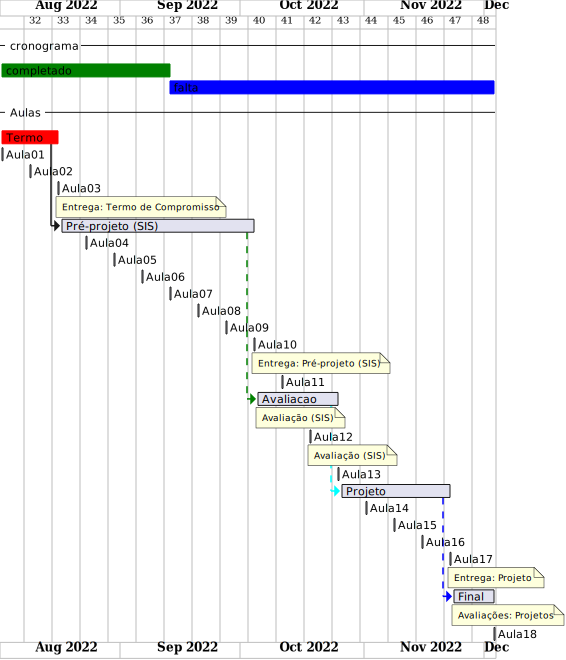
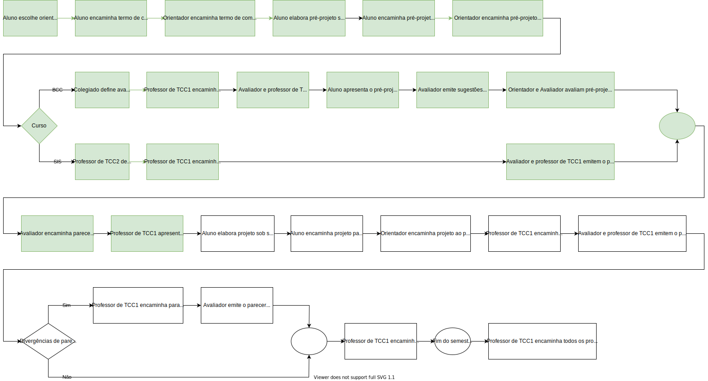

# Cronograma SIS

Local: Remoto (MS-Teams)  
Dia da semana: terça-feira (18:30\~22:00)  

## Cronograma Resumido

<!-- ☞ bbf1208b-fad1-418c-a756-d8618c7a1419 -->
| Prazo      | Atividade                                       |  
| ---------- | ----------------------------------------------- |  
| 16/08      | Entrega do Termo de Compromisso                 |  
| 04/10      | Entrega do pré-projeto (curso de SIS)           |  
| 22/11      | Entrega do Projeto                              |  
|            |                                                 |  

## Cronograma Gantt

  

## Fluxograma

  

## Cronograma Completo

### [Aula_01] 02-08-2022 terça-feira

- [aula01Anotacoes](aula01Anotacoes.md "aula01Anotacoes")  
- Termo - Formulação  

### [Aula_02] 09-08-2022 terça-feira

<!-- \[AVISO] Termo atraso https://github.com/dalton-reis/disciplinaTCC1Privado/projects/1#card-67011391 -->  

- [aula02Anotacoes](aula02Anotacoes.md "aula02Anotacoes")  
- Termo - Formulação  

### [Aula_03] 16-08-2022 terça-feira

- **Entrega do Termo de Compromisso de TCC**  
- [aula03Anotacoes](aula03Anotacoes.md "aula03Anotacoes")  
- Pré-Projeto - Formulação  

### [Aula_04] 23-08-2022 terça-feira

<!-- \[AVISO] Orientadores https://github.com/dalton-reis/disciplinaTCC1Privado/projects/1#card-67524750 -->
- [aula04Anotacoes](aula04Anotacoes.md "aula04Anotacoes")  
- Pré-Projeto - Formulação  

### [Aula_05] 30-08-2022 terça-feira

- [aula05Anotacoes](aula05Anotacoes.md "aula05Anotacoes")  
- Pré-Projeto - Formulação  

### [Aula_06] 06-09-2022 terça-feira

<!-- \[ ] banca SIS https://github.com/dalton-reis/disciplinaTCC1Privado/projects/1#card-67445856 -->  
- Pré-Projeto - Formulação  

### [Aula_07] 13-09-2022 terça-feira

<!-- \[ ] Atendimento SIS: https://github.com/dalton-reis/disciplinaTCC1Privado/projects/1#card-67514774 -->  
- Pré-Projeto - Atendimento Individual  
<!-- **[Atendimento SIS](Material/AtendimentoSIS.png "Atendimento SIS")** -->

### [Aula_08] 20-09-2022 terça-feira

- Pré-Projeto - Atendimento Individual
<!-- **[Atendimento SIS](Material/AtendimentoSIS.png "Atendimento SIS")** -->

### [Aula_09] 27-09-2022 terça-feira

- Pré-Projeto  

### [Aula_10] 04-10-2022 terça-feira

- **Entrega do Pré-Projeto (SIS)**  

### [Aula_11] 11-10-2022 terça-feira

- Revisão dos Pré-Projeto pelos professores de TCC1 e avaliadores.  

### [Aula_12] 18-10-2022 terça-feira

- Revisão dos Pré-Projeto pelos professores de TCC1 e avaliadores.  
- [Escola Regional de Engenharia de Software - ERES](https://eres-sbc-br.github.io/eres2022/ "Escola Regional de Engenharia de Software - ERES")  

### [Aula_13] 25-10-2022 terça-feira

- [aula13Anotacoes](aula13Anotacoes.md "aula13Anotacoes")  
- Análise do Pré-Projeto  

### [Aula_14] 01-11-2022 terça-feira

- Análise do Pré-Projeto - Atendimento Individual  

### [Aula_15] 08-11-2022 terça-feira

- Análise do Pré-Projeto - Atendimento Individual  

### [Aula_16] 15-11-2022 terça-feira

Feriado: Proclamação da República

### [Aula_17] 22-11-2022 terça-feira

- **Entrega do Projeto**  
- Avaliação dos Projetos (banca)  

### [Aula_18] 29-11-2022 terça-feira

- Avaliação dos Projetos (banca)  

### 13-12-2022

- Data final para devolução dos projetos pelos avaliadores  

-----------

Último dia para entregar os diários de classe 2022/2: 03/12/22 - 13/12/22  
